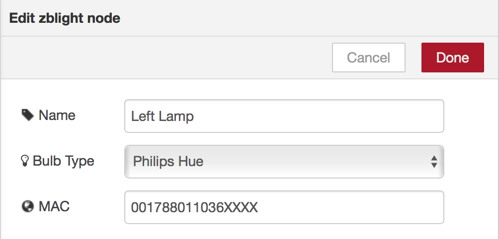

# node-red-contrib-zblight

This project is an addon node for node-red, which allows you to control power and brightness
of various zigbee based smart-bulbs using a Digi XBEE series 2 module.

## Requirements

This requires the following npm packages to work properly:
* node-red-node-serialport
* xbee-api

Install these via npm, inside your node-red directory:
```
npm install node-red-node-serialport xbee-api node-red-contrib-zblight
```

## XBEE Setup

You will need to have an XBEE Series 2 module to communicate with the zigbee network, series 1/xbee 802.15.4 modules will not work.
The XBEE Radio will need to have the Zigbee Coordinator firmware flashed in to it.

In addition, you will need to make sure the following settings are correct:

* ATZS = 2
* ATEE = 1
* ATEO = 1
* ATAO = 1
* ATAP = 1

This ensures that the xbee can communicate with Zigbee ZDO/ZCL devices, which is required by the Zigbee Home Automation Profile.
The ATAP=1 also ensures that the xbee is placed into API mode.

## Usage


The node generates an API packet to be sent to the xbee module. You will need to configure the zblight node with the MAC address of the bulb you want to control, and the type of bulb you want to control.

Control of the bulbs is done fairly simply. Send a message to the node, with one of the following in the payload:
* on
    * _Turns the light on_
* off
    * _Turns the light off_
* toggle
    * _Toggles the light on or off_
* 0 - 255
    * _Dims the light_
* 2700 - 6500
    * _Sets the color temperature (if supported)_
* [0-255],[0,255]
    * _Sets the hue and saturation (if supported)_

If you dim a bulb, then turn it off, the next time you turn it on, it will be at the same brightness level.



In order to figure out the MAC address of the bulbs, as well as making sure the bulb joined your XBEE zigbee coordinator, you can use the Digi XCTU Software discovery mode.


This will show all of the zigbee devices connected to your network, and the routing table between them.
On my test network (above), I have A GE Link bulb (7E), A Cree Connected (E2), and a Philips Hue White (00)

If your bulbs do not connect to your network, or if they have been joined to a different network previously, they will need to be factory reset. For the Link and the Cree bulbs, this is done with a specific on/off pattern, for the hue bulbs, they have to be reset with either a touchlink remote, or the hue hub.

## Compatibility
Currently, the node has been tested with the following bulbs:
* GE Link
* Cree Connected
* Philips Hue White (RGBW bulbs should work, but have not been tested)
* Osram/Sylvania Lightify (White, Tunable White, and RGBW)

Those are the bulbs I currently have, and have been able to test. I will be looking at aquiring more bulbs (including the Philips Hue RGBW bulbs) to add more compatibility.  
These bulbs all support turning power on and off, as well as dimming with this node. The Osram/Sylvania Lightify (Tunable White and RGBW) bulbs have been tested to work with color temperature, as well as hue/saturation changes.
